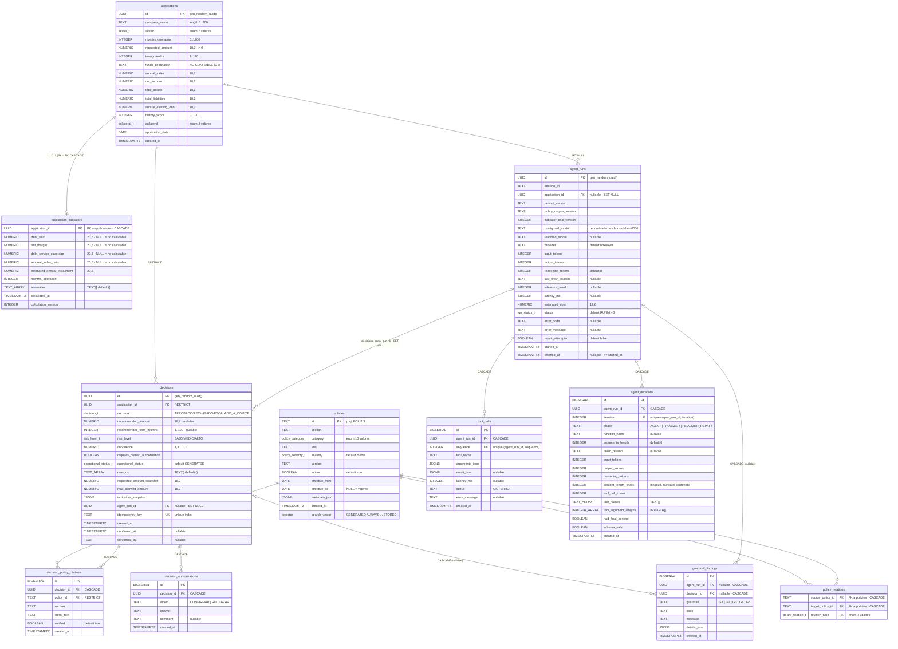

# Modelo de datos (PostgreSQL 16)

Diagrama y notas derivados **exclusivamente** de `database/migrations/*.sql`
(0001 → 0010). No hay tablas, columnas ni relaciones inferidas: todo lo que
aparece aquí existe literalmente en una migración.

La tabla `schema_migrations` (control de versiones del propio migrador) queda
fuera del diagrama por no formar parte del dominio.

---

## Diagrama ER

Los tipos se muestran normalizados para que Mermaid los acepte; la precisión
real (`NUMERIC(18,2)`, `NUMERIC(20,6)`, `NUMERIC(4,3)`, `NUMERIC(12,6)`)
aparece en el comentario de cada columna.



---

### Responsabilidades de las tablas

**Solicitudes** — `applications`, `application_indicators`

`applications` guarda la solicitud tal como la reportó el solicitante, incluido
`funds_destination`, que es texto no confiable y se almacena como dato, nunca
como instrucción. `application_indicators` guarda los cinco indicadores
derivados en una relación 1:0..1 (su clave primaria *es* la foránea), con
`NULL` explícito cuando el indicador no es calculable —denominador cero— y un
`calculation_version` que permite saber con qué versión de la fórmula se
calculó cada fila.

**Corpus de políticas** — `policies`, `policy_relations`

`policies` es el corpus normativo versionado y vigenciado (`version`, `active`,
`effective_from`/`effective_to`), con una columna generada `search_vector` para
búsqueda de texto completo en español. `policy_relations` modela explícitamente
qué política modifica, complementa o depende de cuál, de forma que la relación
regla↔excepción sea un dato consultable y no algo que el modelo deba inferir.

**Dictámenes y evidencia** — `decisions`, `decision_policy_citations`,
`decision_authorizations`

`decisions` es el registro autoritativo del dictamen: decisión, monto y plazo
recomendados, nivel de riesgo, estado operativo, y los *snapshots* contra los
que se evaluó G3 (`requested_amount_snapshot`, `max_allowed_amount`,
`indicators_snapshot`). `decision_policy_citations` guarda la evidencia
verificada literalmente contra el corpus, una fila por política citada.
`decision_authorizations` es la bitácora del acto humano: quién confirmó o
rechazó, cuándo y con qué comentario.

**Observabilidad del agente** — `agent_runs`, `tool_calls`, `agent_iterations`

`agent_runs` registra una ejecución completa: proveedor, modelo configurado
frente al modelo realmente resuelto, versiones de prompt/corpus/cálculo,
tokens, costo, latencia y estado. `tool_calls` guarda cada llamada a
herramienta con sus argumentos, resultado y estado, numerada por `sequence`.
`agent_iterations` guarda diagnóstico por iteración y por fase (`AGENT`,
`FINALIZER`, `FINALIZER_REPAIR`): `finish_reason`, tokens, conteos y
**longitudes** de contenido y argumentos — nunca el contenido ni el
razonamiento.

**Guardarrailes** — `guardrail_findings`

Registro de auditoría de los hallazgos G1–G5 de cada ejecución. Ambas foráneas
son opcionales, porque un hallazgo puede existir antes de que haya dictamen
persistido: un G5 marcado o una cita no recuperada no bloquean el flujo, pero
deben quedar asentados con su código, mensaje y detalle en JSON.

---

### Restricciones importantes en PostgreSQL

Todas las restricciones citadas aquí son literales de las migraciones; los
nombres son los reales, no descriptivos.

**G1 — un dictamen firme exige al menos una cita verificada**

Trigger `decisions_require_citation` sobre `decisions`
(`AFTER INSERT OR UPDATE`, `DEFERRABLE INITIALLY DEFERRED`), que ejecuta la
función `enforce_citation_requirement()`:

```sql
IF NEW.decision IN ('APROBADO','RECHAZADO') THEN
  IF NOT EXISTS (SELECT 1 FROM decision_policy_citations c WHERE c.decision_id = NEW.id) THEN
    RAISE EXCEPTION 'G1: la decision % (%) requiere al menos una cita de politica verificada' ...
```

Impide que se persista un `APROBADO` o un `RECHAZADO` sin evidencia. Es
diferido porque las citas se insertan después del dictamen dentro de la misma
transacción; si al hacer `COMMIT` no hay ninguna, la transacción entera se
revierte. Complemento: `decision_policy_citations.policy_id` es
`REFERENCES policies(id) ON DELETE RESTRICT`, de modo que no se puede citar una
política inexistente ni borrar una política citada.

**G3 — el monto recomendado no puede exceder lo pedido ni el tope de política**

Tres `CHECK` con nombre sobre `decisions`:

```sql
CONSTRAINT g3_amount_le_requested
  CHECK (recommended_amount IS NULL OR recommended_amount <= requested_amount_snapshot)
CONSTRAINT g3_amount_le_policy_cap
  CHECK (recommended_amount IS NULL OR recommended_amount <= max_allowed_amount)
CONSTRAINT g3_amount_positive
  CHECK (recommended_amount IS NULL OR recommended_amount > 0)
```

Impiden que un monto inventado por el modelo llegue a la base: aunque la capa
de aplicación fallara, la fila no entra. Se evalúan contra *snapshots* tomados
en el momento del dictamen, no contra tablas que pueden cambiar después.
Junto a ellos, `rejected_has_no_amount` —
`CHECK (decision <> 'RECHAZADO' OR recommended_amount IS NULL)` — impide un
rechazo con monto recomendado.

**G4 / PENDING_AUTHORIZATION — lo que requiere firma no nace firme**

```sql
CONSTRAINT g4_requires_authorization_flow
  CHECK (
    requires_human_authorization = false
    OR operational_status IN ('PENDING_AUTHORIZATION','CONFIRMED','REJECTED_BY_ANALYST')
  )
```

Sobre `decisions`. Impide que un dictamen marcado como *requiere autorización
humana* quede en `GENERATED` o `DRAFT`, es decir, que se salte el paso humano.
Su complemento es `confirmed_has_timestamp`:

```sql
CONSTRAINT confirmed_has_timestamp
  CHECK (operational_status <> 'CONFIRMED' OR (confirmed_at IS NOT NULL AND confirmed_by IS NOT NULL))
```

que impide un `CONFIRMED` sin quién ni cuándo.

**PENDING_COMMITTEE — escalar no es lo mismo que requerir firma**

Dos `CHECK` con nombre sobre `decisions` (migración 0007):

```sql
CONSTRAINT escalation_goes_to_committee
  CHECK (
    decision <> 'ESCALADO_A_COMITE'
    OR (operational_status = 'PENDING_COMMITTEE' AND requires_human_authorization = false)
  )
CONSTRAINT committee_only_for_escalation
  CHECK (operational_status <> 'PENDING_COMMITTEE' OR decision = 'ESCALADO_A_COMITE')
```

El primero impide que un escalamiento se marque como pendiente de autorización
G4 o se dé por firme; el segundo impide que el estado de comité se use para
algo que no sea un escalamiento. Juntos hacen imposible mezclar los dos actos
humanos.

**Idempotencia — la misma clave nunca produce un segundo dictamen**

```sql
CREATE UNIQUE INDEX decisions_idempotency_key_uidx ON decisions (idempotency_key);
```

Sobre `decisions.idempotency_key` (`NOT NULL`). Impide que un reintento —del
cliente, del stream SSE o de una re-ejecución— cree un dictamen duplicado para
la misma solicitud y el mismo estado de entrada; el segundo intento choca
contra el índice y la aplicación reutiliza el dictamen existente.

**Integridad de `policy_relations`**

```sql
PRIMARY KEY (source_policy_id, target_policy_id, relation_type),
CHECK (source_policy_id <> target_policy_id)
```

más ambas foráneas a `policies(id) ON DELETE CASCADE`. La clave primaria
compuesta impide declarar dos veces la misma relación entre las mismas dos
políticas; el `CHECK` sin nombre impide que una política se relacione consigo
misma; y las foráneas impiden relaciones hacia políticas inexistentes y
eliminan las relaciones huérfanas si una política se borra.

**Otras restricciones de dominio relevantes**

- `guardrail_findings.guardrail` — `CHECK (guardrail IN ('G1','G2','G3','G4','G5'))`.
- `agent_iterations.phase` — `CHECK (phase IN ('AGENT','FINALIZER','FINALIZER_REPAIR'))`.
- `tool_calls` — `UNIQUE (agent_run_id, sequence)`; `agent_iterations` — `UNIQUE (agent_run_id, iteration)`; `decision_policy_citations` — `UNIQUE (decision_id, policy_id, section)`.
- `agent_runs` — `CHECK (finished_at IS NULL OR finished_at >= started_at)`.
- `policies` — `CHECK (effective_to IS NULL OR effective_to >= effective_from)`.
- `decisions.confidence` — `CHECK (confidence >= 0 AND confidence <= 1)`.
- `decisions.application_id` — `ON DELETE RESTRICT`: no se borra una solicitud con dictámenes.

---

### Decisiones de almacenamiento

**`NUMERIC`, nunca `FLOAT`.** Todo el dinero es `NUMERIC(18,2)` y los
indicadores derivados `NUMERIC(20,6)`; `confidence` es `NUMERIC(4,3)` y el
costo estimado `NUMERIC(12,6)`. La aritmética binaria de punto flotante
introduce error de representación en cantidades decimales, que en un dictamen
crediticio es inaceptable. La cadena es completa: `decimal.js` en la
aplicación, string decimal de escala fija en cada frontera y `NUMERIC` en la
base, con el type parser de `pg` forzado a devolver string para que el driver
no convierta a `number` en el camino de vuelta.

**Búsqueda de texto completo nativa, con `tsvector` generado.** `policies`
tiene una columna `search_vector tsvector GENERATED ALWAYS AS (...) STORED` que
combina `setweight(to_tsvector('spanish', section), 'A')` con
`setweight(to_tsvector('spanish', text), 'B')`. Al ser generada, no puede
quedar desincronizada del texto: no hay trigger de mantenimiento ni paso de
reindexado que pueda olvidarse. El peso A/B hace que un acierto en el título de
la sección pese más que uno en el cuerpo. La categoría **no** entra al vector:
el cast `enum→text` es `STABLE`, no `IMMUTABLE`, y además filtrar por la
columna `category` con su propio índice es exacto en vez de aproximado.

**Índice GIN sobre el `tsvector`.** `policies_search_idx ON policies USING GIN
(search_vector)`. GIN es el índice adecuado para valores compuestos por muchas
claves —los lexemas de un documento— y da búsquedas rápidas sobre un corpus que
se lee mucho y se escribe poco. Con esto la búsqueda de políticas es una
consulta SQL sobre PostgreSQL, sin base vectorial ni embeddings: **no hay
retrieval semántico en este sistema**.

**`policy_relations` como tabla, no como campo.** Que POL-7.3 modifique
parcialmente a POL-2.3 es un hecho del corpus. Guardarlo como filas tipadas
(`OVERRIDES_PARTIALLY`, `OVERRIDES_FULLY`, `COMPLEMENTS`, `DEPENDS_ON`) con
integridad referencial permite recuperar la excepción junto con la regla y
evita que el modelo tenga que deducir por su cuenta qué política gana.

**Migraciones SQL planas, sin ORM.** Diez archivos numerados y aplicados en
orden, con el SQL a la vista. El esquema *es* el guardarraíl: los `CHECK`, el
trigger diferido y los índices únicos son la última línea de defensa, y quedan
legibles y revisables sin traducir desde una capa de abstracción. Un par de
migraciones existen precisamente por límites del motor: 0007 va separada de
0006 porque PostgreSQL no permite usar un valor de enum recién agregado dentro
de la misma transacción que lo agregó.

**PostgreSQL 16.** Un solo motor cubre todo lo que este sistema necesita:
tipos exactos para dinero, enums nativos, arreglos, `JSONB` para snapshots y
detalles de hallazgos, columnas generadas, búsqueda de texto completo con
diccionario en español, triggers de restricción diferidos y transacciones que
permiten insertar dictamen y citas como una unidad indivisible. Sin servicios
externos, sin base vectorial, sin motor de búsqueda aparte.
